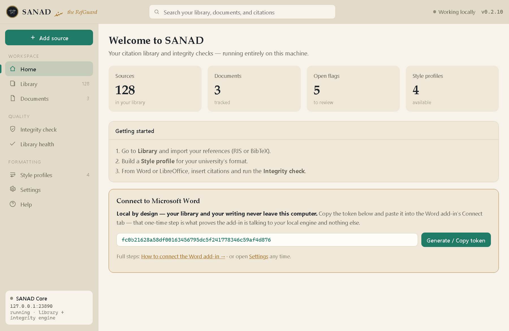
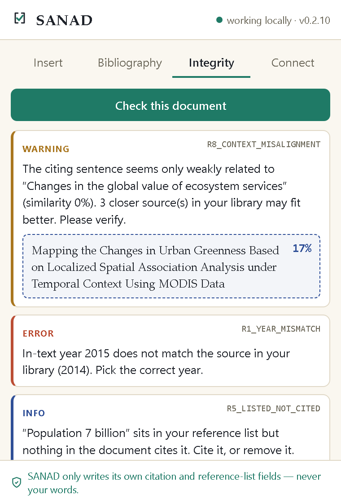

<div align="center">


# SANAD — the RefGuard

**Check that every citation is *actually right* — the right source, cited in the right place — without ever touching a word of your prose.**

A free, open-source, **local-first** citation companion for Microsoft Word and LibreOffice.
No account. No cloud. Your library and your writing never leave your computer.

[](https://github.com/sajidmahmoodfarooqi-png/SANAD-thRefGuard/releases/latest)
[](https://github.com/sajidmahmoodfarooqi-png/SANAD-thRefGuard/actions/workflows/ci.yml)
[](LICENSE)
[](https://github.com/sajidmahmoodfarooqi-png/SANAD-thRefGuard/releases)


### [⬇ Download for Windows](https://github.com/sajidmahmoodfarooqi-png/SANAD-thRefGuard/releases/latest)

</div>



---

## Why SANAD?

Most reference tools stop at *formatting* — they make a citation *look* right. SANAD goes one step
further and checks whether it *is* right: the correct source, the correct year, cited in a sentence
that's actually about that source. It does this **entirely on your own machine**, and it is built so
it **physically cannot edit your sentences** — it only ever writes inside its own citation and
reference-list fields.

If you're finishing a thesis or a paper and you're worried about a mis-cited year, a book that got
resolved to a *review* of that book, a reference that nobody actually cites, or a citation dropped
into the wrong paragraph — SANAD is built for exactly that.

## What makes it different

| | |
|---|---|
| 🔎 **Context-integrity checking** | Beyond "does it look right" — catches wrong in-text year, a book resolved to a review venue, orphaned/duplicate references, author–year ambiguity, and (with a local model) a citation dropped into the *wrong context*, suggesting a better source from your own library. |
| 🔒 **Local-first, private by design** | The engine runs on `127.0.0.1` on your machine and makes **no outbound connections**. No account, no cloud, no telemetry. Your unpublished work stays yours. |
| ✍️ **Never touches your prose** | SANAD only ever writes inside its own citation/bibliography fields. The boundary is **enforced in code and proven by a fuzz test**, not just promised. |
| 🎓 **Handbook-driven formatting** | Turn your university's rules into a shareable **Style Profile** (`.sanadstyle.json`) — indent, "et al." threshold, ampersand rule, spacing — layered over a real CSL style. |
| 🌍 **Bilingual by design** | First-class right-to-left / Urdu support. |

## See it in Word

The add-in puts SANAD *inside* Word — **Insert** a citation, rebuild the **Bibliography**, and run an
**Integrity** check, all without leaving your document.

<p align="center"></p>

## Get started in 3 steps

1. **[Download and install](https://github.com/sajidmahmoodfarooqi-png/SANAD-thRefGuard/releases/latest)** the Windows app, then open it.
2. **Import your references** (RIS or BibTeX — every reference manager exports these), or try the
   [sample pack](examples/) to see it working in two minutes.
3. **Connect Word** once: in the app, open **Settings → Connect to Microsoft Word** and copy the
   token; in Word, load the add-in and paste it into the **Connect** tab. Then insert citations and
   run **Integrity**.

> **Just want to try it?** Grab [`examples/sample-library.ris`](examples/sample-library.ris) and
> [`examples/sample-thesis.docx`](examples/sample-thesis.docx) — the sample document has deliberately
> planted problems (a wrong year, a duplicate, a citation out of context) so you can watch SANAD
> catch them.

## What the integrity check catches

| Rule | Catches |
|---|---|
| **R1** | In-text year doesn't match the source |
| **R2** | A book resolved to a *review of* the book, not the book |
| **R3** | A citation points to a source no longer in your library |
| **R4 / R5** | A cited source missing from the list / a listed source nobody cites |
| **R6** | Two library entries that look like the same work |
| **R7** | Two sources sharing author + year with no a/b suffix |
| **R8** | A citation dropped into an unrelated sentence — with a closer source suggested. *SANAD suggests, you decide.* |

> **On R8:** the semantic check runs at full strength when the optional
> `sentence-transformers` model is installed; otherwise it falls back to a lighter
> word-overlap check. The app and the add-in report which mode is active (the
> `/v1/health` response carries `semantic_check`), so it never implies a true
> semantic check when only the fallback is present.

## Privacy

SANAD is **local-first**: your library is a single file on your machine, the engine listens only on
`127.0.0.1`, and it makes no outbound connections. The Word add-in's one-time token exists purely to
prove the add-in is talking to *your* local engine and nothing else. No account, no cloud, no
tracking.

📄 Full [Privacy Policy](https://sajidmahmoodfarooqi-png.github.io/SANAD-thRefGuard/privacy.html).

---

## For developers & contributors

SANAD is early and **actively looking for testers and contributors** — see
[CONTRIBUTING.md](CONTRIBUTING.md) and [open an issue](https://github.com/sajidmahmoodfarooqi-png/SANAD-thRefGuard/issues)
with anything you find. Good first things to try: run it against a real thesis and report what the
integrity checker misses or over-flags.

**Run the Core from source:**

```bash
pip install -r requirements.txt
python -m sanad_core.server          # serves the local engine on 127.0.0.1:23890
pytest                               # the full test suite
```

**Repository layout:**

| Path | What it is |
|---|---|
| `sanad_core/` | The **Core** — SQLite library, RIS/BibTeX/typed import, CSL rendering, Style Profiles, the Tier-A/Tier-B integrity engine, the write-boundary document model, and the local HTTP + WebSocket service. |
| `app/` | The **desktop app** (Electron) that runs the Core and provides the library / integrity / formatting UI. |
| `connectors/word/` | The **Word add-in** (Office.js task pane) — a thin client of the local Core. |
| `packaging/` | PyInstaller spec + build scripts that freeze the Core for release. |
| `tests/` | The pytest suite. All sample data is small and invented — no real bibliography ships here. |
| `CONCEPT.md` · `MVP_SPEC.md` | Product vision · Phase-1 technical spec (data model, protocol, rules, Style Profile format). |

**How a release is made:** push a `vX.Y.Z` tag → CI runs the tests, freezes the Core, builds the
Windows installer, and publishes a GitHub Release. See [CHANGELOG.md](CHANGELOG.md).

## License

[GNU AGPLv3](LICENSE). SANAD is free and open-source; if you run a modified version as a network
service, the AGPL requires you to share your changes.

<div align="center"><sub><b>SANAD</b> · سند — Arabic/Urdu for a <i>chain of authority</i>, and for a certificate or proof.</sub></div>
